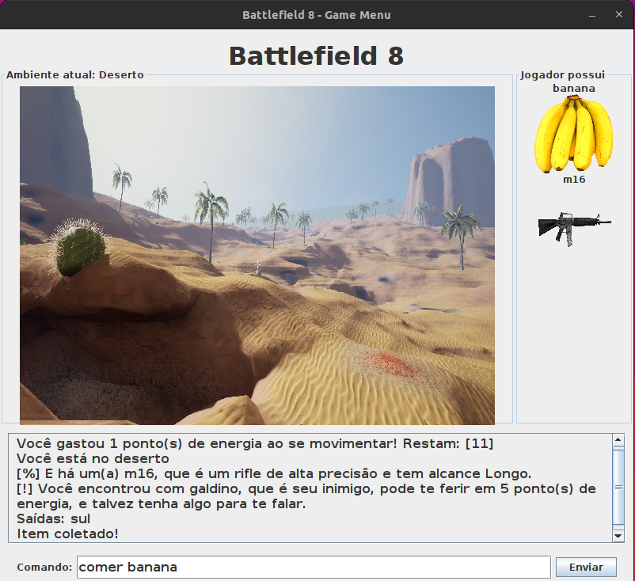

## Projeto Prático Java - Battlefield 8

### Sobre o Jogo:

> O jogador se encontra em um acampamento militar no meio de uma guerra. Entre tantos ambientes, ele tem que resistir à fome e aos inimigos no campo de batalha, com o objetivo de chegar são e salvo na sua família, que está na cidade. O problema é que ele perdeu a chave do carro e não sabe onde está. Para essa missão, ele conta com alguns alimentos espalhados pelos ambientes e armas para se defender.

## Executar o Jogo

- Executar o ***App.java*** para iniciar o jogo com interface grafica.
- Executar o ***AppTerminal.java*** para iniciar o jogo por terminal.

## Comandos do Jogo

Digite ***ajuda*** para ver os comandos do jogo.